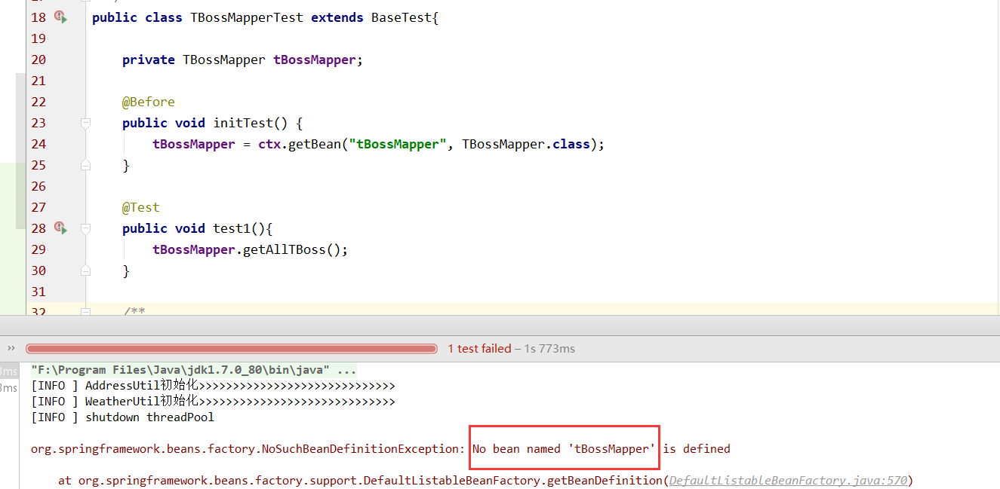
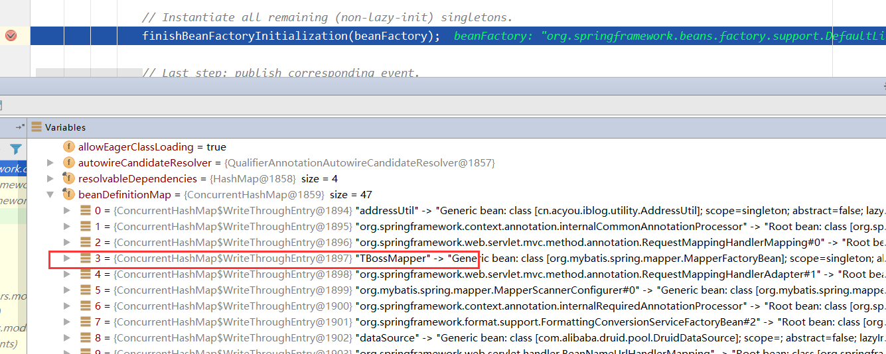
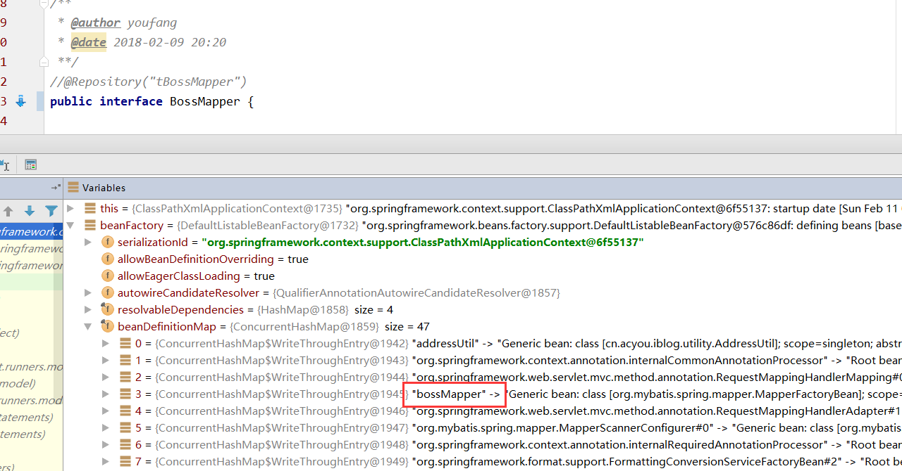

### MyBatis中mapperBean的注入
#### 最近遇到一个问题：
1. 写了一个Mapper`TBossMapper`，配置了自动扫描理论上一切正常才对，最后运行的时候居然找不到Bean。
2. 需要添加上@Repository("tBossMapper")注解才正常。

#### 最终在beanFactory中发现一些端倪，Bean的Id并不是所预料的Id。

#### 最后将前面的T去掉后，终于一切正常了...

> 结论：**类不要使用两个大写字母开头**
